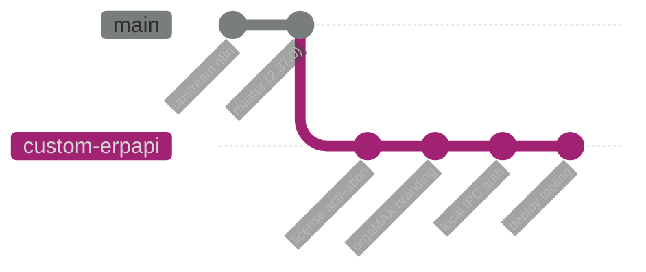
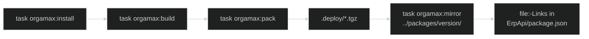

# ErpApi-Deploy: Build- und Packaging-Ablauf

Dieses Repository ist ein Fork von n8n mit orgaMAX-spezifischen Anpassungen. Das
Ziel des Deploys sind `.tgz`-Archive aller Workspace-Packages, die das
ErpApi-Projekt per `file:`-Link in seiner `package.json` einbindet.

## orgaMAX-Dokumentation

- [Aktivierungs-Workflow](N8N_ACTIVATING_WF.MD)
- [Fester Benutzer-Login](N8N_FIXED_USER_LOGIN.MD)
- [Entfernung der Aktivierungspflicht](N8N_REMOVE_ACTIVATION.MD)

## Hauptweg

Der vollständige n8n-Package-Deploy läuft über das Root-`Taskfile.yml`:

```bash
task orgamax:deploy
```

Er führt strikt `orgamax:install`, `orgamax:build`, `orgamax:pack` und
`orgamax:mirror` aus. Der Mirror prüft das Manifest und legt den vollständigen
`.deploy`-Stand versioniert unter `../packages/<root-package-version>` ab.
`task orgamax:dry-run` listet die zu packenden Packages ohne Änderung auf.

## Branch-Modell

| Branch | Zweck | Regel |
| --- | --- | --- |
| `master` | Spiegel des Upstream-Stands von `n8n-io/n8n` | Nicht anfassen. Bleibt sauber, damit jederzeit gegen Upstream rebased werden kann. |
| `custom-erpapi` | Deploy-Branch mit allen Fork-Anpassungen | Hier wird entwickelt, gebaut und gepackt. |
| `develop` | Alter Fork-Stand (v2.5.0, Januar 2026) | Historie. Wurde nach `custom-erpapi` überführt und ist nicht mehr aktuell. |



Upstream-Updates werden auf `master` gezogen und von dort in `custom-erpapi`
gemerged oder rebased — nie umgekehrt.

## Voraussetzungen

| Werkzeug | Version | Prüfen mit |
| --- | --- | --- |
| Node.js | `>=24.0.0` | `node -v` |
| pnpm | `>=11.22.0` | `pnpm -v` |

Eine ältere pnpm-Version erzeugt einen inkonsistenten `node_modules`-Baum. Das
äußert sich als Typecheck-Fehler in scheinbar unbeteiligten Packages, etwa
Versionskonflikte zwischen zwei `@typescript-eslint/types`-Ständen in
`@n8n/eslint-plugin-community-nodes`.

## Der Ablauf



### 1. Dependencies installieren

```bash
git switch custom-erpapi
task orgamax:install
```

Dauert bei leerem `node_modules` mehrere Minuten. Die Warnungen
`Failed to create bin at ... workflow-sdk` sind erwartbar — die Bin-Links zeigen
auf `dist`-Dateien, die erst der Build erzeugt. Sie lösen sich mit Schritt 2.

**Ohne diesen Schritt schlägt jeder Build sofort fehl.** Das war die Ursache des
zuletzt fehlgeschlagenen Builds: `node_modules` fehlte komplett.

### 2. Bauen

```bash
task orgamax:build
tail -n 20 build.log
```

Der Build umfasst 70 Turbo-Tasks. Bei kaltem Cache dauert er etwa 10–15 Minuten,
`n8n-editor-ui` allein rund eine Minute.

Nach dem Build meldet `git status` rund 43 geänderte `.generated.yml`-Dateien
unter `packages/cli/src/public-api/`. Das ist **kein** inhaltlicher Unterschied,
sondern reines CRLF/LF-Rauschen: der Generator schreibt LF, `core.autocrlf=true`
will CRLF. `git diff` auf diese Dateien ist leer. Verwerfen mit:

```bash
git checkout -- packages/cli/src/public-api
```

Wer das dauerhaft loswerden will, ergänzt `.gitattributes` um
`*.generated.yml text eol=lf`.

Bei stale Build-Outputs (etwa nach einem Branch-Wechsel) hilft `pnpm reset`; erst
wenn das nicht reicht, `pnpm reset --full` (wirft `node_modules` weg und
installiert neu).

### 3. Packages packen

```bash
task orgamax:pack
```

| Befehl | Wirkung |
| --- | --- |
| `task orgamax:pack` | Packt nach `.deploy/`. Setzt einen abgeschlossenen Build voraus. |
| `task orgamax:dry-run` | Listet nur, was gepackt würde. |
| `task orgamax:deploy` | Installiert, baut, packt und spiegelt versioniert. |

Ergebnis: 65 Tarballs plus `packing-manifest.json` in `.deploy/`, zusammen rund
49 MB. Der Ordner ist gitignored.

Das Skript (`scripts/deploy-packages.mjs`) arbeitet in dieser Reihenfolge:

1. Alle `packages/**/package.json` einsammeln, die nicht `private: true` sind.
2. Abbrechen, falls `packages/cli/dist` fehlt — sonst entstünden leere Tarballs.
3. `.deploy/` leeren.
4. Die drei Frontend-Manifeste sichern, die `trim-fe-packageJson.js` umschreibt
   (`@n8n/chat`, `@n8n/design-system`, `editor-ui`), und den Trim ausführen. Er
   entfernt `scripts`, `devDependencies` und bei `editor-ui` auch `dependencies`,
   damit die Tarballs keinen Dev-Ballast in ErpApi einschleppen.
5. Jedes Package mit `pnpm pack --pack-destination` packen und prüfen, dass die
   erwartete Datei entstanden ist.
6. Die gesicherten Manifeste im `finally`-Block zurückrollen — auch wenn das
   Packen mittendrin abbricht.

Wird der Lauf hart abgebrochen (Ctrl+C, Task-Kill), greift Schritt 6 nicht und
die drei Manifeste bleiben getrimmt liegen. Der nächste Lauf erkennt das und
bricht mit dem passenden `git restore`-Befehl ab, statt den getrimmten Zustand
als neues Backup zu sichern.

### 4. Versioniert spiegeln

```bash
task orgamax:mirror
```

Der Mirror übernimmt exakt die manifestierten Tarballs und
`packing-manifest.json` nach `../packages/<root-package-version>`. Er prüft
vorher Root-/CLI-Version, fehlgeschlagene oder doppelte Packages sowie die
vollständige Tarball-Liste. Das bestehende Versionsverzeichnis wird über Backup
und Rollback ersetzt.

### 5. ErpApi-Handoff

Der Mirror ändert ErpApi nicht. Danach setzt ein eigener Task die `file:`-Links
in `ErpApi/package.json` auf den gespiegelten Stand:

```bash
task orgamax:erpapi-link              # Default-Ziel ../ErpApi
task orgamax:erpapi-link -- /c/WORKSPACE/ErpApi
```

`scripts/link-erpapi-packages.mjs` arbeitet in zwei Schritten: erst fliegen
**alle** bisherigen `file:packages/`-Einträge aus `dependencies` und
`devDependencies`, dann wird jedes Package aus dem gespiegelten
`packing-manifest.json` neu eingetragen und sein Tarball nach `ErpApi/packages/`
kopiert. Die `package.json` wird atomar über eine Temp-Datei ersetzt, die Keys
bleiben alphabetisch sortiert.

Weil alte Einträge grundsätzlich entfernt werden, verschwindet ein entfallenes
Package von selbst — es gibt keinen Abbruch und keine Liste zu pflegen.

### dependencies oder devDependencies

Die Sektion wird nicht geraten, sondern aus dem Monorepo abgeleitet: das Script
berechnet das transitive Closure über `dependencies` ab `n8n` und ordnet ein
Package genau dann `dependencies` zu, wenn es darin liegt. Beim aktuellen Stand
sind das 53 von 65 Packages; die übrigen 12 landen in `devDependencies`.

Die Regel ist absichtlich funktional und nicht semantisch. `@n8n/typescript-config`
klingt nach Tooling, wird aber von `@n8n/ai-utilities` und
`@n8n/n8n-nodes-langchain` als `dependencies` deklariert und muss deshalb auch
bei `npm install --production` vorhanden sein.

| Situation | Verhalten |
| --- | --- |
| Bisheriger `file:packages/`-Link | wird entfernt und neu gesetzt, ggf. in der anderen Sektion |
| Package nicht mehr im Manifest | Link verschwindet, kein Abbruch |
| Neues Package im Manifest | wird ergänzt, Sektion per Runtime-Closure |
| `file:`-Link auf etwas anderes als `packages/` | bleibt unberührt |
| Registry-Dependency (`^4.19.2` o. ä.) | bleibt unberührt |
| Manifest fehlt in `../packages/<version>` | Abbruch mit Hinweis auf `task orgamax:mirror` |
| Nicht mehr referenzierter Tarball in `ErpApi/packages/` | wird berichtet, **nicht** gelöscht |

Der Task greift in ein fremdes Projekt ein und hängt deshalb bewusst **nicht** in
`orgamax:deploy`. Die Verantwortung für Install, Service-Deploy, Smoke-Test und
Rollback in ErpApi bleibt bewusst separat.

## Was sich gegenüber v2.5.0 geändert hat

Der letzte Deploy (`C:\WORKSPACE\packages\2.5.0`) enthielt 42 Packages, der
aktuelle Stand hat 65. Neu hinzugekommen sind unter anderem `@n8n/agents`,
`@n8n/engine`, `@n8n/crdt`, `@n8n/telemetry`, `@n8n/typeorm`, `@n8n/scheduler`,
`@n8n/instance-ai`, `@n8n/expression-runtime`, `@n8n/workflow-sdk`,
`@n8n/blob-storage`, `@n8n/mcp-apps`, `@n8n/mcp-browser` und mehrere
`@n8n/frontend-*`-Packages.

Weggefallen ist `n8n-node-dev`; an seine Stelle tritt `@n8n/cli`.

ErpApi bindet aktuell 41 Packages per `file:`-Link ein. Ob die neuen Packages
dort gebraucht werden, hängt davon ab, welche n8n-Einstiegspunkte ErpApi nutzt —
`n8n` selbst zieht sie als Dependencies nach, dann müssen sie ebenfalls als
`file:`-Link vorliegen, sonst holt npm die Registry-Version.

## Fork-Anpassungen

Alle Eingriffe in Upstream-Code sind mit `[CUSTOM-FORK]` markiert. Vor jedem
Rebase lohnt sich:

```bash
grep -rn "CUSTOM-FORK" packages/ --include=*.ts --include=*.vue
```

| Bereich | Dateien | Wirkung |
| --- | --- | --- |
| Lizenz | `packages/cli/src/license.ts`, `license/license.service.ts`, `commands/base-command.ts` | `init()` aktiviert lokal einen Enterprise-Plan, statt das LicenseManager-SDK zu starten. Aktivierung, Renewal und Trial-Registrierung sind No-Ops ohne externe Calls. |
| Portalzugang | `packages/cli/src/auth/auth.service.ts` | `createAuthMiddleware` stellt einem Request **von Loopback ohne gültiges Cookie** einmalig eine echte Owner-Session aus; ab dann läuft alles den regulären Session-Pfad. Jede andere Herkunft erhält unverändert 401. Kein Bootstrap, solange MFA erzwungen ist oder der Owner fehlt bzw. deaktiviert ist. |
| Public API | `packages/cli/src/services/local-ipc-auth.strategy.ts`, `server.ts` | Requests von Loopback-Adressen werden als Instance-Owner authentifiziert, damit ErpApi die Public API ohne API-Key anspricht. |
| Branding | `OrgaMaxLogo.vue`, `MainSidebarHeader.vue`, `AuthView.vue`, `CustomFeaturesPanel.vue`, `public/static/logos/` | orgaMAX-Logo in Sidebar und Login. |

### Konventionen für Fork-Eingriffe

Damit Rebases beherrschbar bleiben, gelten drei Regeln, die beim Heben auf 2.37.0
angewendet wurden:

- **Upstream-Signaturen unverändert lassen.** Der alte Fork hatte
  Konstruktor-Parameter aus `License` und `LicenseService` entfernt. Das brach 14
  Upstream-Tests und erzeugte Folgefehler. Jetzt bleiben die Signaturen
  identisch; nicht mehr genutzte Parameter tragen ein `_`-Präfix.
- **Keine auskommentierten Original-Blöcke.** Der alte Fork behielt den
  ersetzten Upstream-Code als Kommentar. Das hielt Hilfsmethoden künstlich am
  Leben, erzeugte 24 Typecheck-Fehler und kollidiert bei jedem Rebase. Das
  Original steht in `master` — ein Verweis genügt.
- **Erweiterungspunkte nutzen, statt zu patchen.** Der IPC-Bypass hing
  ursprünglich als Middleware plus zwei Bypass-Blöcke in
  `public-api-key.service.ts`. Master bietet mit `AuthStrategyRegistry` einen
  vorgesehenen Registrierungspunkt. Der Fork berührt damit eine einzige
  Upstream-Zeile statt vier Patch-Blöcke.

## Bekannte Punkte

### Authentifizierung ist vollständig abgeschaltet

`createAuthMiddleware` lässt jeden Request durch — nicht nur lokale. Wer die
Instanz über das Netz erreicht, hat vollen Zugriff auf UI und API ohne
Anmeldung. Die Instanz darf deshalb ausschließlich an `127.0.0.1` gebunden
betrieben werden (`N8N_LISTEN_ADDRESS=127.0.0.1`), niemals an `0.0.0.0`.

Der IPC-Bypass in `LocalIpcAuthStrategy` wäre für den ErpApi-Anwendungsfall
allein ausreichend und ist auf Loopback beschränkt. Der pauschale
`next()`-Aufruf in `auth.service.ts` geht deutlich darüber hinaus — falls er
nicht gebraucht wird, ist sein Entfernen die wirksamste Härtung.

### Localhost-Erkennung

`LocalIpcAuthStrategy` wertet nur `req.socket.remoteAddress` aus. Die
ursprüngliche Fassung akzeptierte zusätzlich `X-Forwarded-For` und `Host` als
Beleg für Localhost — beide sind client-kontrolliert, ein entfernter Angreifer
hätte mit `X-Forwarded-For: 127.0.0.1` Owner-Rechte auf der Public API erhalten.
Diese Auswertung wurde beim Heben entfernt; zwei Tests decken die
Spoofing-Versuche ab.

### Lizenzstatus

Die lokale Enterprise-Aktivierung umgeht die Lizenzprüfung für Features, die
unter `LICENSE_EE.md` stehen. Das ist eine lizenzrechtliche Frage, keine
technische.

### Tests unter Windows ausführen

Die `test`-Scripts der Packages setzen Environment-Variablen in POSIX-Syntax
(`N8N_LOG_LEVEL=silent vitest run`). pnpm führt Scripts unter Windows über
`cmd.exe` aus, wo das als Befehlsname interpretiert wird:

```text
Der Befehl "N8N_LOG_LEVEL" ist entweder falsch geschrieben oder
konnte nicht gefunden werden.
```

Aus der Git Bash funktioniert stattdessen der direkte Aufruf:

```bash
cd packages/cli
N8N_LOG_LEVEL=silent DB_TYPE=sqlite DB_SQLITE_POOL_SIZE=4 \
  pnpm exec vitest run src/services/__tests__/local-ipc-auth.strategy.test.ts
```

Typecheck analog:

```bash
cd packages/cli && pnpm exec tsc --noEmit -p tsconfig.json
```

### Windows-Pfade als Prozessargument

`pnpm pack --pack-destination C:\WORKSPACE\n8n-custom\.deploy` scheitert, weil
`\n` als Escape-Sequenz gedeutet wird:

```text
ENOENT: no such file or directory, mkdir 'C:\WORKSPACE
8n-custom\.deploy'
```

Das Deploy-Skript übergibt den Pfad deshalb mit Forward-Slashes. Wer weitere
Skripte ergänzt, die Pfade an externe Prozesse reichen, sollte dasselbe tun.

## Erledigte Verbesserungen

- `.gitattributes` trägt `*.generated.yml text eol=lf`, damit der Build keinen
  Dirty-State mehr hinterlässt.
- Der pauschale `next()`-Aufruf in `auth.service.ts` ist ersetzt. Statt jeden
  Request durchzulassen, bekommt nur ein Request von Loopback ohne gültiges
  Cookie einmalig eine echte Owner-Session; alles andere erhält wieder 401.
  Abgedeckt von `packages/cli/src/auth/__tests__/auth.service.test.ts`
  (`local portal loopback bootstrap`).
- `task orgamax:erpapi-link` ersetzt alle `file:packages/`-Links aus dem
  `packing-manifest.json` und sortiert sie per Runtime-Closure nach
  `dependencies` bzw. `devDependencies` ein.

## Nächste Schritte

- [ ] `task orgamax:erpapi-link` scharf gegen `C:\WORKSPACE\ErpApi` laufen lassen.
      Bisher nur gegen eine Kopie der echten `package.json` geprüft. Der Lauf setzt
      65 Links, verschiebt 9 Einträge zwischen den Sektionen und kopiert 65 Tarballs.
- [ ] Nach dem scharfen Lauf `npm install` in ErpApi ausführen und prüfen, dass die
      9 Sektionswechsel keinen Build brechen. Belegt ist nur, dass ErpApi keines der
      12 devDependencies-Packages im Quellcode importiert.
- [ ] Einen Smoke-Test definieren, der nach dem Deploy bestätigt, dass ErpApi die
      n8n-Public-API über Loopback ohne API-Key erreicht.
- [ ] **Ungeprüft:** bestätigen, dass das Auth-Cookie im Browser ankommt.
      `N8N_SECURE_COOKIE` ist per Default `true`, das Portal läuft aber über
      `http://`. Moderne Browser akzeptieren `Secure`-Cookies auf
      `localhost`/`127.0.0.1` (trustworthy origin), ältere nicht. Symptom bei
      Ablehnung: die Login-Seite erscheint immer wieder, weil jeder Request ohne
      Cookie einen neuen Bootstrap auslöst. Workaround dann
      `N8N_SECURE_COOKIE=false` — nur zulässig, solange ausschließlich an
      Loopback gebunden gelauscht wird.
- [ ] Bestätigen, dass die Instanz im Betrieb tatsächlich nur an Loopback
      gebunden lauscht. Der Portalzugang setzt genau das voraus; hinter einem
      Reverse Proxy trägt der Socket die Proxy-Adresse, nicht die des Clients.
